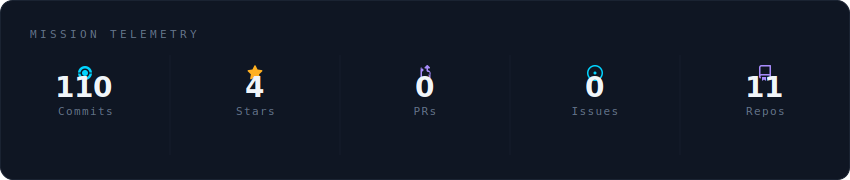

  

 

  

 

  

 

  

 

<strong>🚀 Decodificando o Perfil (Clique para expandir)</strong>

 

> *"Transformo dados e linhas de código em soluções digitais robustas."*

Olá! Sou **Aqsuel Freire**, desenvolvedor **Full Stack** e entusiasta de **Data Science**.
Combino a lógica poderosa do **Python** com a interatividade moderna do **React/Next.js** para criar aplicações web de alta performance.

🔭 **Atualmente:**
- 🎓 Estudante de **Ciência e Tecnologia na UFERSA** (Mossoró/RN).
- 💻 Focado em automação, análise de dados e desenvolvimento web moderno.
- ⚙️ Criando soluções freelancers e bots de automação (Telegram/Web Scraping).

📍 **Base:** Assú - RN, Brasil

 

  
  
  

  

