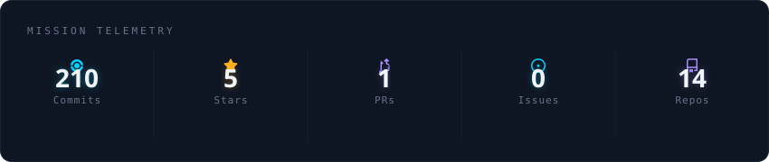

  

 

  

 

  

 

  

 

  

 

<strong>🚀 Decodificando o Perfil (Clique para expandir)</strong>

 

> *"Transformo dados e linhas de código em soluções digitais robustas."*

Olá! Sou **Aqsuel Freire**, desenvolvedor **Full Stack** e entusiasta de **Data Science**.
Combino a lógica poderosa do **Python** com a interatividade moderna do **React/Next.js** para criar aplicações web de alta performance.

🔭 **Status da Missão:**
- 🎓 Graduando em **Ciência e Tecnologia na UFERSA** (Previsão: Dezembro/2026).
- 📜 Especializações concluídas: **Jornada Python** (Hashtag Treinamentos) e **Imersão em Análise de Dados** (XPeriun).
- 💻 Em desenvolvimento: Criando um **bot de WhatsApp para gestão autônoma de tarefas** e aprimorando a arquitetura deste portfólio.
- 🌍 Idiomas: Português (Nativo), Inglês (Avançado) e Russo (Básico).
- ⚙️ Foco em automação, extração de insights a partir de dados e desenvolvimento moderno com impactos reais.

📍 **Base:** Assú - RN, Brasil

 

  
  
  

  

